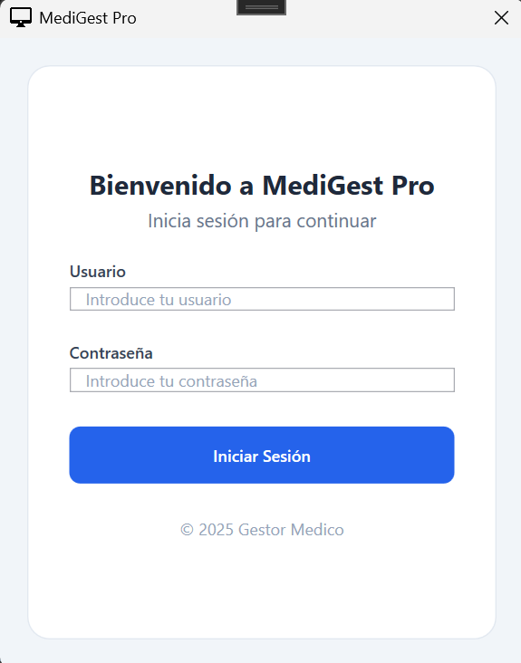
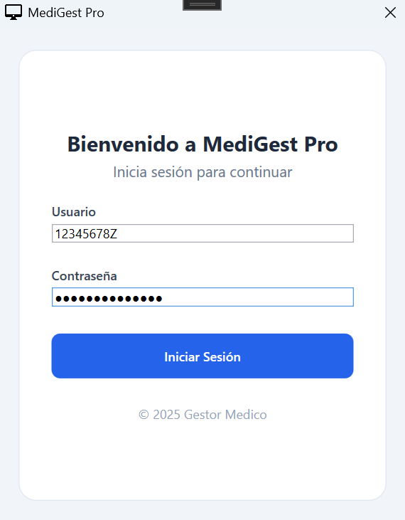
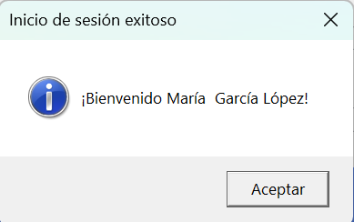
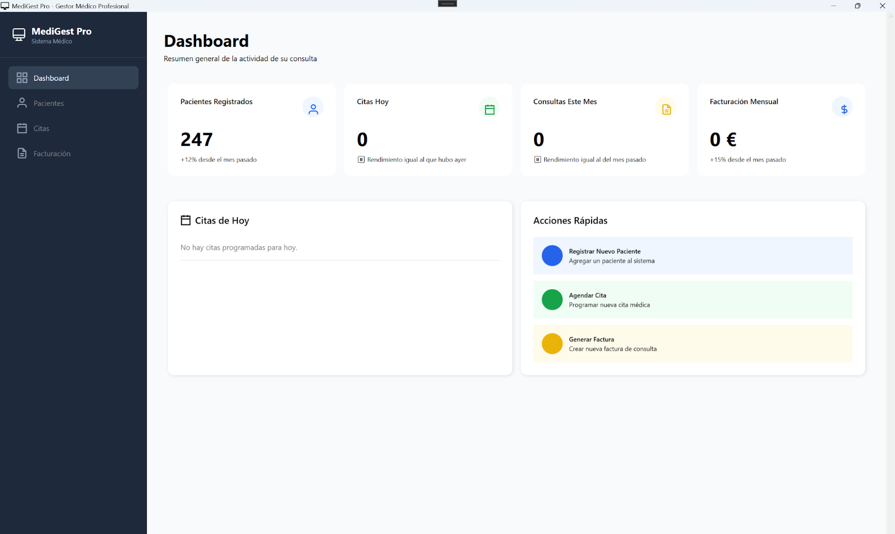
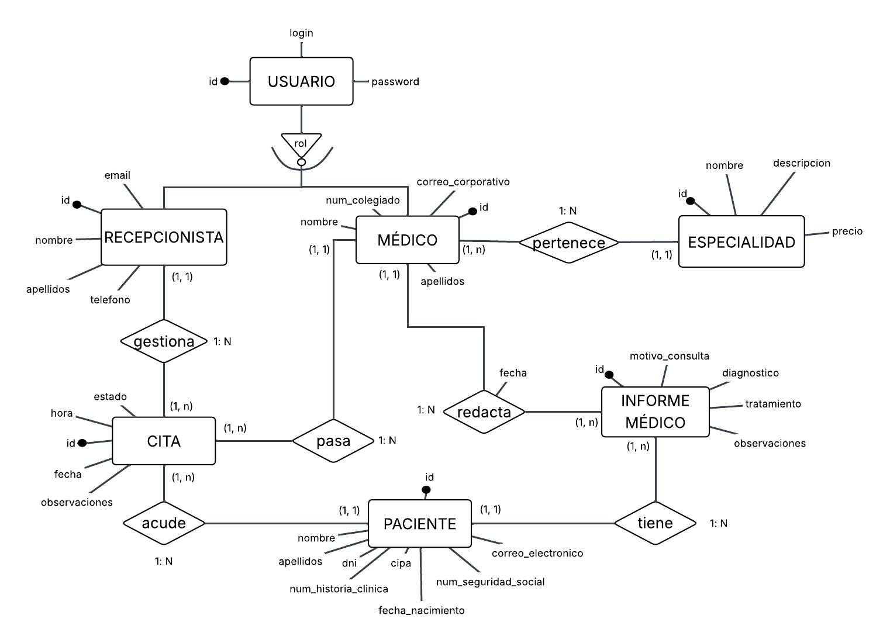
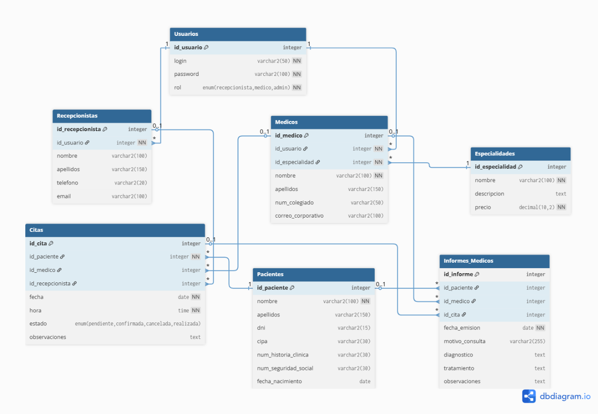

# MediGest
TFG

MediGest Pro es una aplicación de escritorio desarrollada en **C# y WPF** para la gestión integral de clínicas privadas. Permite centralizar las tareas esenciales de administración: gestión de pacientes, citas, informes médicos, facturación y notificaciones por correo electrónico.

## ✨ Funcionalidades principales
- **Gestión de pacientes**: registro, edición y filtrado.
- **Citas médicas**: creación, modificación y eliminación con validaciones.
- **Informes médicos**: consulta y generación automática en PDF.
- **Facturación**: creación de facturas en PDF por rango de fechas.
- **Sistema de usuarios**: roles de Administrador, Médico y Recepcionista.
- **Notificaciones automáticas**: envío de correos mediante plantillas HTML.

## 🛠 Tecnologías utilizadas
- **C# / .NET**
- **WPF**
- **MySQL** (vía XAMPP)
- **Entity Framework Core**
- **iTextSharp** (PDF)
- **SMTP Gmail**

## 📁 Estructura del proyecto

/Clases → Entidades y modelos
/Data → Contexto EF Core y conexión MySQL
/Pages → Interfaces XAML y lógica
/Services → Servicio de envío de correos
/Resources → Logo, estilos, plantillas HTML, BD
/Facturaciones → Facturas generadas
/InformesMedicos → Informes PDF generados

## ▶️ Ejecución
1. Instalar y activar **XAMPP** (Apache + MySQL).
2. Importar la base de datos usando el script SQL incluido en la documentación.
3. Configurar la cadena de conexión en el contexto del proyecto.
4. Ejecutar la aplicación desde **Visual Studio**.

## 📄 Documentación
La documentación completa del proyecto (diagramas, análisis, casos de uso, validaciones, anexos, etc.) se encuentra incluida en la **Memoria del Proyecto** disponible en este repositorio:

- [Memoria del Proyecto (PDF)](TFG.pdf).

## 🖼 Capturas y diagramas
A continuación se muestran las principales capturas y diagramas de la aplicación:

### Formularios y pantallas

  
  
  

### Diagramas de la base de datos

<!-- ## 🖼 Capturas y diagramas
A continuación se muestran las principales capturas y diagramas de la aplicación:

### Formularios y pantallas
- **Formulario de bienvenida:**   
- **Formulario de bienvenida:**   
- **Formulario de bienvenida:**   
- **Dashboard (pantalla principal con estadísticas):** 

### Diagramas de la base de datos
- **Esquema Entidad-Relación:**   
- **Esquema Relacional (tablas):** 
- [Memoria del Proyecto (PDF)](TFG.pdf). -->
  
## 👥 Autores
- Manuel Sánchez Romero  
- Ana Anastasia Bratkiv Bratkiv  
- María Martín Tadeo  
